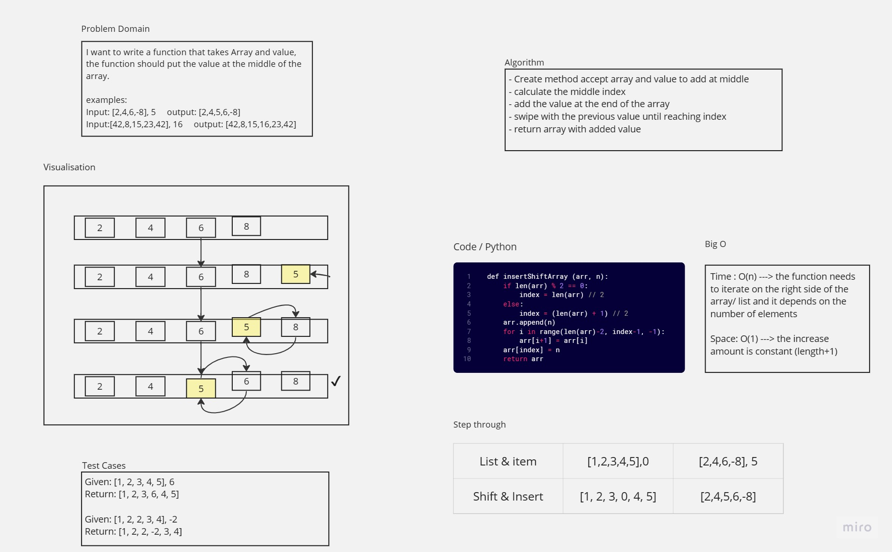

# Insert-Shift-Array 
Write a function called insertShiftArray which takes in an array and a value to be added. Without utilizing any of the built-in methods available to your language, return an array with the new value added at the middle index.
## Whiteboard Process

## Approach & Efficiency
<!-- What approach did you take? Why? What is the Big O space/time for this approach? -->
    - Create method accept array and value to add at middle
    - calculate the middle index
    - add the value at the end of the array
    - swipe with the previous value until reaching index
    - return array with added value<br>
Big O<br>
Time : O(n) ---> the function needs to iterate on the right side of the array/ list and it depends on the number of elements
<br>
Space: O(1) ---> the increase amount is constant (length+1)

## Solution
``` python
def insertShiftArray (arr, n):
    if len(arr) % 2 == 0:
        index = len(arr) // 2
    else:
        index = (len(arr) + 1) // 2
    arr.append(n)
    for i in range(len(arr)-2, index-1, -1):
        arr[i+1] = arr[i]
    arr[index] = n
    return arr
```