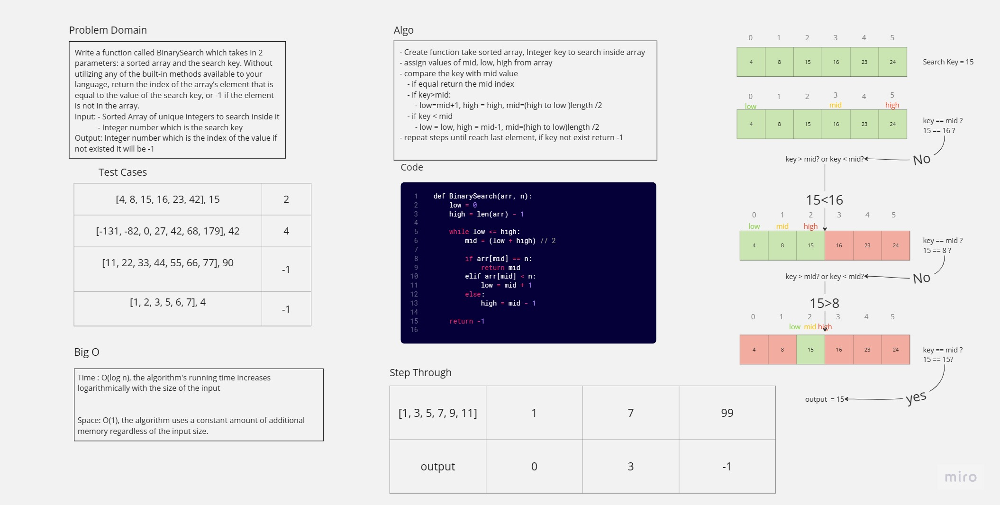

# Array Binary Search
- Write a function called BinarySearch which takes in 2 parameters: a sorted array and the search key. Without utilizing any of the built-in methods available to your language, return the index of the array’s element that is equal to the value of the search key, or -1 - if the element is not in the array.
NOTE: The search algorithm used in your function should be a binary search.

## Whiteboard Process


## Approach & Efficiency
- Create function take sorted array, Integer key to search inside array
- assign values of mid, low, high from array
- compare the key with mid value
    - if equal return the mid index
    - if key>mid:
        - low=mid+1, high = high, mid=(high to low )length /2
    - if key < mid
        - low = low, high = mid-1, mid=(high to low)length /2
- repeat steps until reach last element, if key not exist return -1
## Solution
```python
def BinarySearch(arr, n):
    low = 0
    high = len(arr) - 1
    
    while low <= high:
        mid = (low + high) // 2
        
        if arr[mid] == n:
            return mid
        elif arr[mid] < n:
            low = mid + 1
        else:
            high = mid - 1
    
    return -1
```