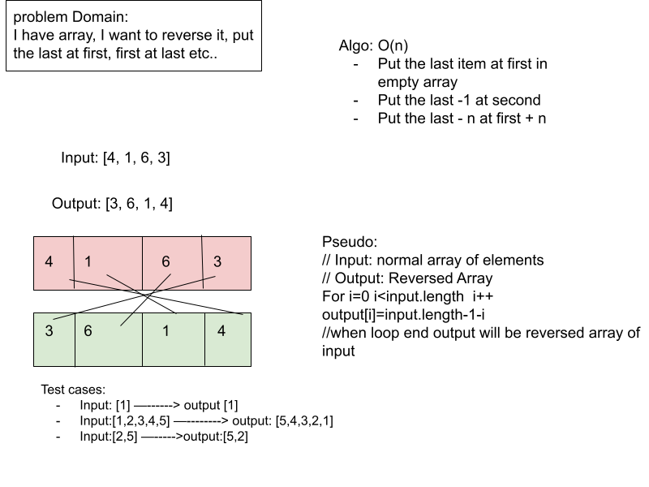

# Challenge Title
Write a function called reverseArray which takes an array as an argument. Without utilizing any of the built-in methods available to your language, return an array with elements in reversed order.
## Whiteboard Process


## Approach & Efficiency
<!-- What approach did you take? Why? What is the Big O space/time for this approach? -->
### Approach
- Make new array to store the reversed value
- Take the last element of array 
- Put it at the end of the new array
- do the same for the same elements
I took this approach because it is simple
### Big O
Big O:
Time O(n) --> it depends on array length
Space O(n) --> it depends on array length

## Solution
<!-- Show how to run your code, and examples of it in action -->
code:
``` JavaScript
function reverseArray (arr)
{
    var reversed = [];
    for (var i = arr.length - 1; i >= 0; i--)
    {
        reversed[reversed.length] = arr[i];
    }
    return reversed;
}
```