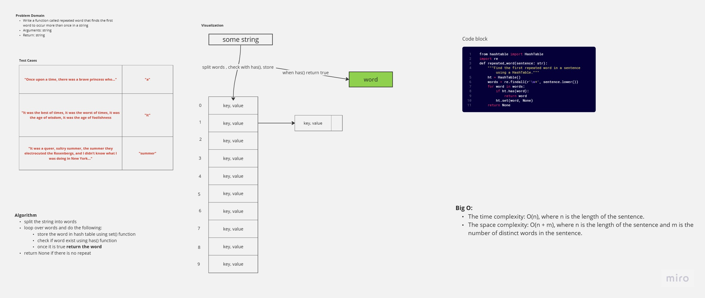

# CC31 - Repeated Word
<!-- Description of the challenge -->
write a function that accepts a lengthy string parameter, return the first word to occur more than once in that provided string.
## Whiteboard Process
<!-- Embedded whiteboard image -->

## Approach & Efficiency
<!-- What approach did you take? Why? What is the Big O space/time for this approach? -->
- The time complexity of the repeated_word function is O(n), where n is the length of the sentence.
- The space complexity of the repeated_word function is O(n + m), where n is the length of the sentence and m is the number of distinct words in the sentence.

## Solution
<!-- Show how to run your code, and examples of it in action -->
```python
from hashtable import HashTable 
import re
def repeated_word(sentence: str):
    """Find the first repeated word in a sentence using a HashTable."""
    ht = HashTable()
    words = re.findall(r'\w+', sentence.lower())
    for word in words:
        if ht.has(word):
            return word
        ht.set(word, None)
    return None
```