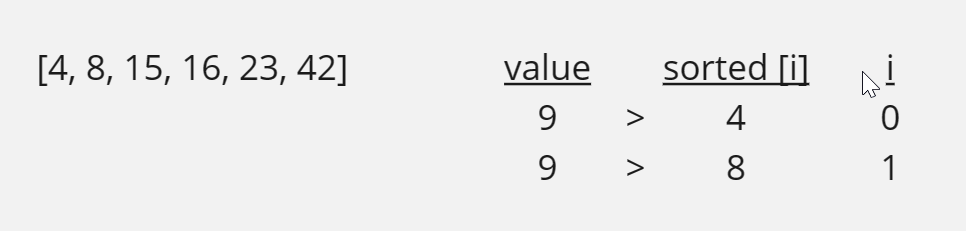
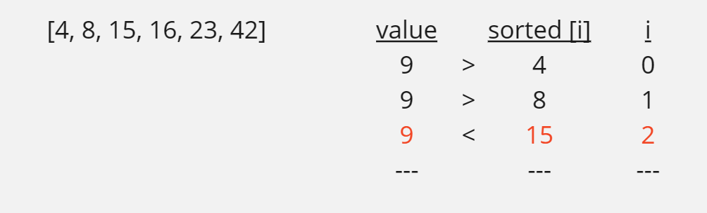
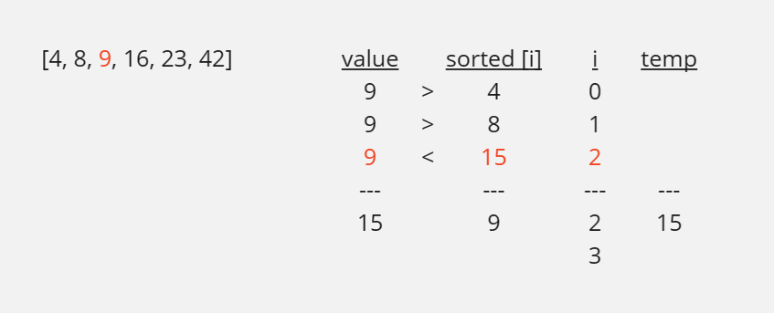
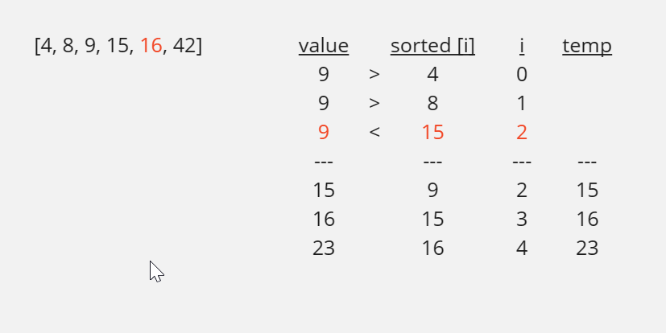

# Insertion Sort
## Pseudo Code
```
Insert(int[] sorted, int value)
  initialize i to 0
  WHILE value > sorted[i]
    set i to i + 1
  WHILE i < sorted.length
    set temp to sorted[i]
    set sorted[i] to value
    set value to temp
    set i to i + 1
  append value to sorted

InsertionSort(int[] input)
  LET sorted = New Empty Array
  sorted[0] = input[0]
  FOR i from 1 up to input.length
    Insert(sorted, input[i])
  return sorted
```
## Trace
```
[8, 4, 23, 42, 16, 15]
[4, 8, 9, 15, 16, 23]
value = 9
```

### step 1:
compare 9 with 4 and 8, 9 is greater than 4 and 8, so we move to the next index

### step 2:
we quit the while loop because 9 is not greater than 15

### step 3:
we start the next loop and we set temp to 15, then we set 15 to 9 and 15 to value, then we increment i

### step 4:
we complete the same process for the rest of the array


### step 5:
we quit the loop because i is equal to the length of the array, and we append the value to the sorted array

