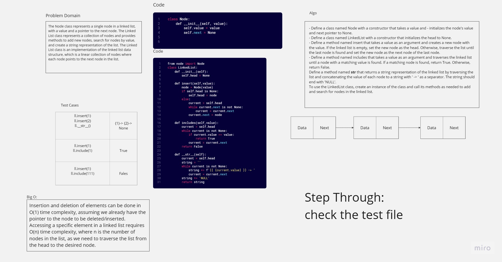

# Challenge Title
Linked List
## Whiteboard Process

## Approach & Efficiency
- Approach:

Linked list is a data structure consisting of a sequence of nodes, each node containing data and a reference (pointer) to the next node in the sequence.
Insertion and deletion operations in a linked list can be done efficiently by changing the pointers of the nodes, without the need to shift elements as in arrays.
- Efficiency:

Insertion and deletion of elements can be done in O(1) time complexity, assuming we already have the pointer to the node to be deleted/inserted.
Accessing a specific element in a linked list requires O(n) time complexity, where n is the number of nodes in the list, as we need to traverse the list from the head to the desired node.
Linked lists can be more memory-efficient than arrays, as they only allocate memory for the nodes that are actually needed, unlike arrays that have a fixed size.


## Solution
- Node:
``` python
class Node:
    def __init__(self, value):
        self.value = value
        self.next = None
```
- Linked List: 
``` python
from node import Node
class LinkedList:
    def __init__(self):
        self.head = None

    def insert(self,value):
        node = Node(value)
        if self.head is None:
            self.head = node
        else:
            current = self.head
            while current.next is not None:
                current = current.next
            current.next = node
        
    def includes(self,value):
        current = self.head
        while current is not None:
            if current.value == value:
                return True
            current = current.next
        return False
    
    def __str__(self):
        current = self.head
        string = ''
        while current is not None:
            string += f'{{ {current.value} }} -> ' 
            current = current.next
        string += 'NULL'
        return string
```