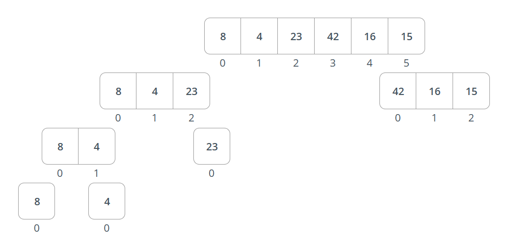
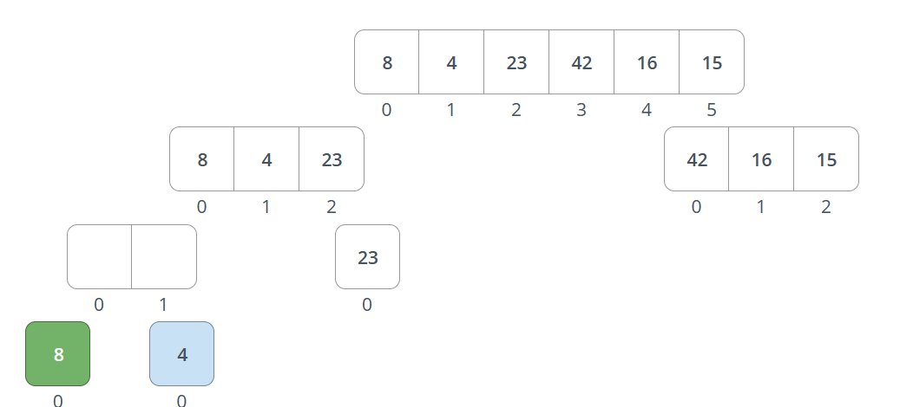
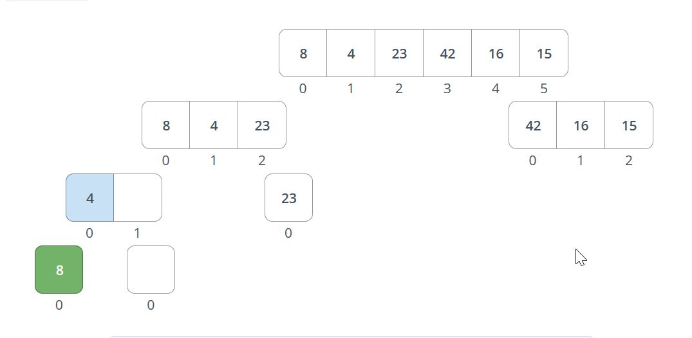
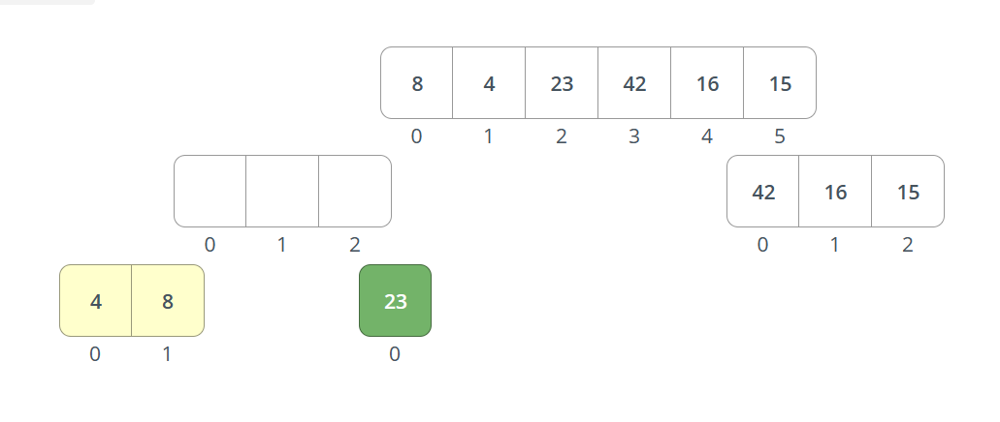
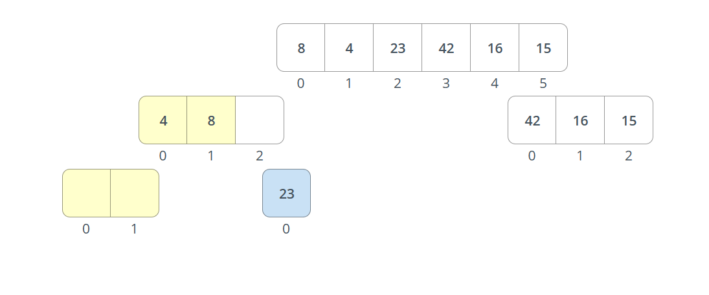
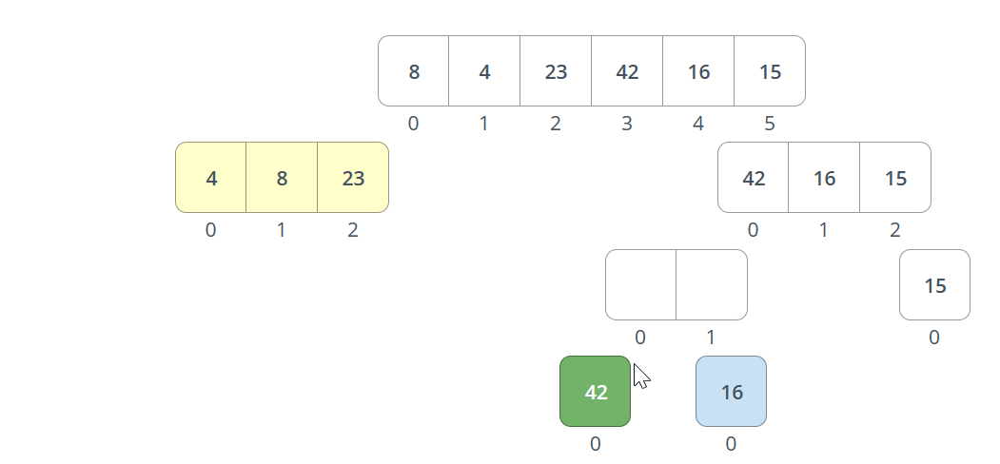
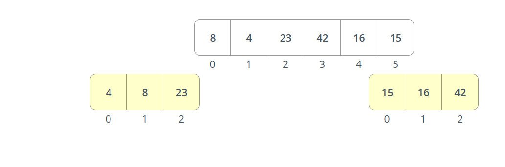
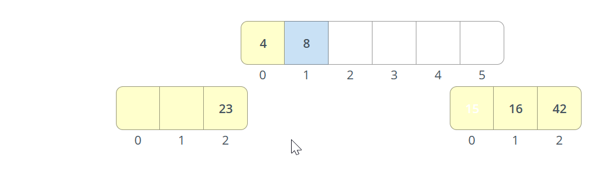

# Merge Sort
## Steps

- Divide the unsorted array into twp sublists of about half the size.
- Continuously divide each sublist into two sublists until you reach the base case of 1 element.

- Repeatedly merge partitioned left units to produce new sublists until there is only 1 right sublist remaining. This will be the sorted list at the end.

- Do the same for the right half.

- Merge the two sorted sublists back into one sorted list, compare each element of the two sublists and place the smaller element in the new list. This will be done until all elements are in the new sorted list.

- Repeat the process until the whole list is sorted.

## Complexity
- Time Complexity: O(nlog(n))
- Space Complexity: O(n)
