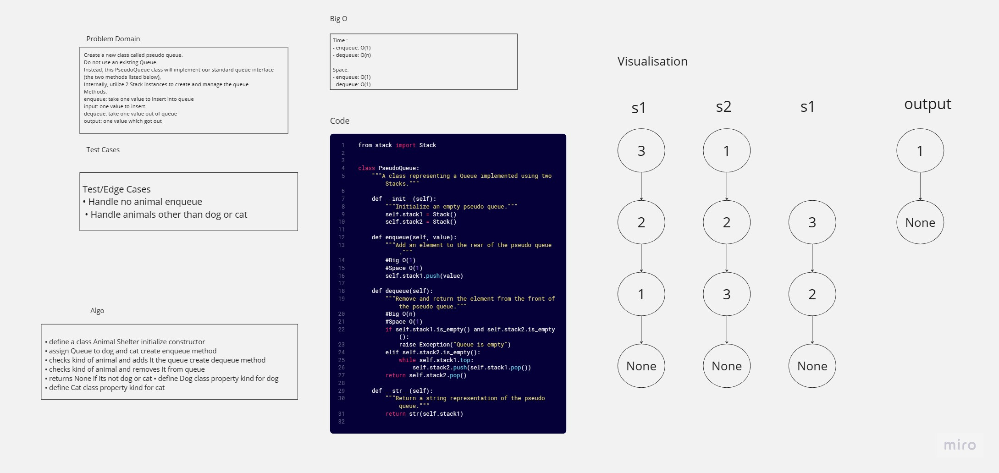

# CC11: stack-queue-pseudo
A class representing a Queue implemented using two Stacks.

## Whiteboard Process

## Approach & Efficiency
- **Enqueue**:
    - When an element is enqueued, it is pushed onto **`stack1`**, which represents adding the element to the rear of the queue.
    - This operation has a time complexity of O(1) as it involves a single stack push operation.
    - The space complexity is also O(1) as it requires constant additional space.
- **Dequeue**:
    - When an element is dequeued, the method first checks if both **`stack1`** and **`stack2`** are empty. If they are, it raises an exception indicating that the queue is empty.
    - If **`stack2`** is empty, the method transfers elements from **`stack1`** to **`stack2`**. It does this by popping elements from **`stack1`** and pushing them onto **`stack2`** until **`stack1`** becomes empty.
    - Finally, the method pops and returns the top element from **`stack2`**, which represents removing an element from the front of the queue.
    - The time complexity of the dequeue operation is O(n) in the worst case because it involves transferring elements from **`stack1`** to **`stack2`** when **`stack2`** is empty.
    - The space complexity is O(1) as it requires constant additional space.
## Solution
```python
from stack import Stack


class PseudoQueue:
    """A class representing a Queue implemented using two Stacks."""

    def __init__(self):
        """Initialize an empty pseudo queue."""
        self.stack1 = Stack()
        self.stack2 = Stack()

    def enqueue(self, value):
        """Add an element to the rear of the pseudo queue."""
        #Big O(1)
        #Space O(1)
        self.stack1.push(value)

    def dequeue(self):
        """Remove and return the element from the front of the pseudo queue."""
        #Big O(n)
        #Space O(1)
        if self.stack1.is_empty() and self.stack2.is_empty():
            raise Exception("Queue is empty")
        elif self.stack2.is_empty():
            while self.stack1.top:
                self.stack2.push(self.stack1.pop())
        return self.stack2.pop()

    def __str__(self):
        """Return a string representation of the pseudo queue."""
        return str(self.stack1)

```