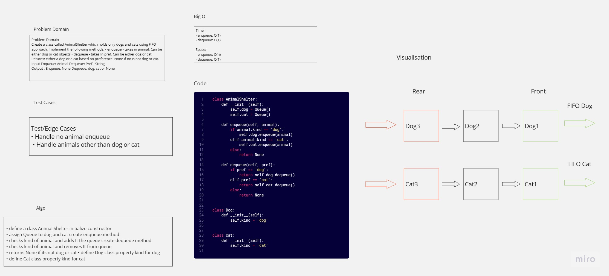

# stack-queue-animal-shelter
<!-- Description of the challenge -->
Create a class called AnimalShelter which holds only dogs and cats.
The shelter operates using a first-in, first-out approach.
Implement the following methods:
enqueue
Arguments: animal
animal can be either a dog or a cat object.
It must have a species property that is either "cat" or "dog"
It must have a name property that is a string.
dequeue
Arguments: pref
pref can be either "dog" or "cat"
Return: either a dog or a cat, based on preference.
If pref is not "dog" or "cat" then return null.
## Whiteboard Process
<!-- Embedded whiteboard image -->

## Approach & Efficiency
<!-- What approach did you take? Why? What is the Big O space/time for this approach? -->
### Big O:
Time :
- enqueue: O(1)
- dequeue: O(1)

Space:
- enqueue: O(n)
- dequeue: O(1)
### Algorithm: 
- define a class Animal Shelter initialize constructor 
- assign Queue to dog and cat create enqueue method
- checks kind of animal and adds It the queue create dequeue method 
- checks kind of animal and removes It from queue 
- returns None if its not dog or cat 
- define Dog class property kind for dog 
- define Cat class property kind for cat 
## Solution
``` python
from queue import Queue

class AnimalShelter:
    def __init__(self):
        self.dog = Queue()
        self.cat = Queue()

    def enqueue(self, animal):
        """Enqueue an animal to the animal shelter."""
        if animal.kind == 'dog':
            self.dog.enqueue(animal)
        elif animal.kind == 'cat':
            self.cat.enqueue(animal)
        else:
            return None

    def dequeue(self, pref):
        """Dequeue and return an animal from the animal shelter based on the preference.

        Raises:
            ValueError: If there are no animals of the preferred type available.
        """
        if pref == 'dog' and not self.dog.is_empty():
            return self.dog.dequeue()
        elif pref == 'cat' and not self.cat.is_empty():
            return self.cat.dequeue()
        else:
            raise ValueError("No animals available")


class Dog:
    def __init__(self):
        self.kind = 'dog'


class Cat:
    def __init__(self):
        self.kind = 'cat'

```


