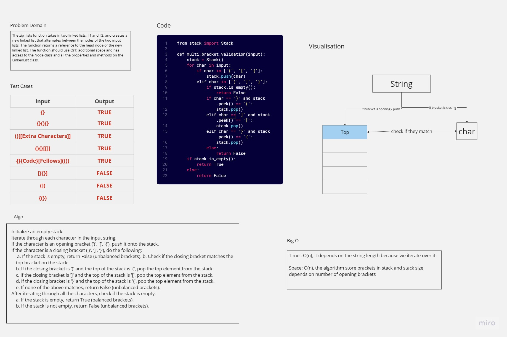

# CC13 - stack-queue-brackets
<!-- Description of the challenge -->
Write a function called validate brackets   
Arguments: string  
Return: boolean representing whether or not the brackets in the string are balanced   
There are 3 types of brackets:  
- Round Brackets : ()
- Square Brackets : []
- Curly Brackets : {}


## Whiteboard Process
<!-- Embedded whiteboard image -->


## Approach & Efficiency
<!-- What approach did you take? Why? What is the Big O space/time for this approach? -->
Approach:

1. The algorithm uses a stack to validate whether the brackets in the input string are balanced.
2. It iterates through each character in the input string and performs specific actions based on the type of bracket encountered.
3. Opening brackets are pushed onto the stack, and closing brackets are compared with the top of the stack to ensure they match.
4. If the brackets are balanced, the stack will be empty at the end of the iteration.

Efficiency:

- Time complexity: O(n), where n is the length of the input string. The algorithm iterates through each character once.
- Space complexity: O(n), where n is the length of the input string. In the worst case, all opening brackets are pushed onto the stack before encountering any closing brackets, resulting in the stack size being proportional to the input size.

## Solution
<!-- Show how to run your code, and examples of it in action -->
```python
from stack import Stack
from queue import Queue

def multi_bracket_validation(input):
    """Validate if brackets in input string are balanced."""
    stack = Stack()
    for char in input:
        if char in ['(', '[', '{']:
            stack.push(char)
        elif char in [')', ']', '}']:
            if stack.is_empty():
                return False
            if char == ')' and stack.peek() == '(':
                stack.pop()
            elif char == ']' and stack.peek() == '[':
                stack.pop()
            elif char == '}' and stack.peek() == '{':
                stack.pop()
            else:
                return False
    if stack.is_empty():
        return True
    else:
        return False
```