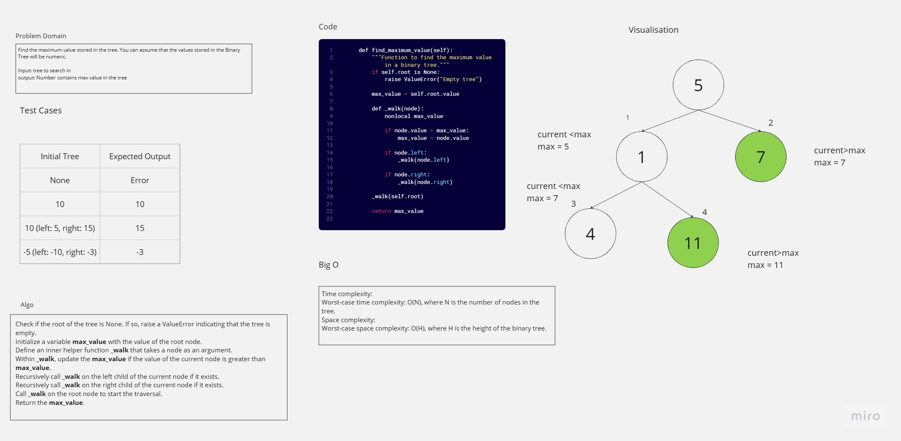

# Tree Max
<!-- Description of the challenge -->
Find the maximum value stored in the tree. You can assume that the values stored in the Binary Tree will be numeric.


## Whiteboard Process
<!-- Embedded whiteboard image -->


## Approach & Efficiency
<!-- What approach did you take? Why? What is the Big O space/time for this approach? -->
### Approach
1. Check if the root of the tree is None. If so, raise a ValueError indicating that the tree is empty.
2. Initialize a variable **`max_value`** with the value of the root node.
3. Define an inner helper function **`_walk`** that takes a node as an argument.
4. Within **`_walk`**, update the **`max_value`** if the value of the current node is greater than **`max_value`**.
5. Recursively call **`_walk`** on the left child of the current node if it exists.
6. Recursively call **`_walk`** on the right child of the current node if it exists.
7. Call **`_walk`** on the root node to start the traversal.
8. Return the **`max_value`**.
### Efficiency
- Time complexity:
Worst-case time complexity: O(N), where N is the number of nodes in the tree.
- Space complexity:
Worst-case space complexity: O(H), where H is the height of the binary tree.


## Solution
<!-- Show how to run your code, and examples of it in action -->
```python
    def find_maximum_value(self):
        """Function to find the maximum value in a binary tree."""
        if self.root is None:
            raise ValueError("Empty tree")

        max_value = self.root.value

        def _walk(node):
            nonlocal max_value

            if node.value > max_value:
                max_value = node.value

            if node.left:
                _walk(node.left)

            if node.right:
                _walk(node.right)

        _walk(self.root)

        return max_value
```