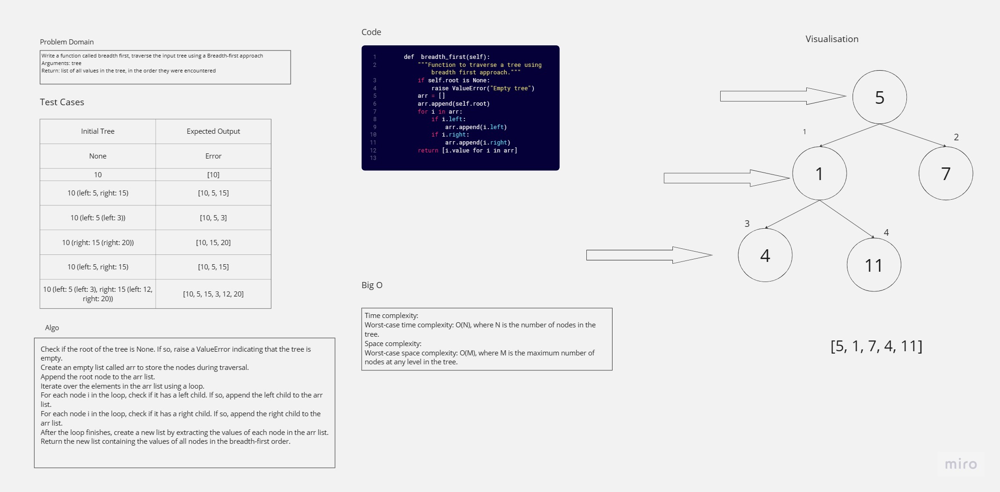

# Tree Max
<!-- Description of the challenge -->
Write a function called breadth first
- Arguments: tree
- Return: list of all values in the tree, in the order they were encountered


## Whiteboard Process
<!-- Embedded whiteboard image -->


## Approach & Efficiency
<!-- What approach did you take? Why? What is the Big O space/time for this approach? -->
### Approach
1. Check if the root of the tree is None. If so, raise a ValueError indicating that the tree is empty.
2. Create an empty list called **`arr`** to store the nodes during traversal.
3. Append the root node to the **`arr`** list.
4. Iterate over the elements in the **`arr`** list using a loop.
5. For each node **`i`** in the loop, check if it has a left child. If so, append the left child to the **`arr`** list.
6. For each node **`i`** in the loop, check if it has a right child. If so, append the right child to the **`arr`** list.
7. After the loop finishes, create a new list by extracting the values of each node in the **`arr`** list.
8. Return the new list containing the values of all nodes in the breadth-first order.
### Efficiency
Time complexity:

- Worst-case time complexity: O(N), where N is the number of nodes in the tree.

Space complexity:

- Worst-case space complexity: O(M), where M is the maximum number of nodes at any level in the tree.

## Solution
<!-- Show how to run your code, and examples of it in action -->
```python
    def  breadth_first(self):
        """Function to traverse a tree using breadth first approach."""
        if self.root is None:
            raise ValueError("Empty tree")
        arr = []
        arr.append(self.root)
        for i in arr:
            if i.left:
                arr.append(i.left)
            if i.right:
                arr.append(i.right)
        return [i.value for i in arr]
```